# Current Architecture Flowcharts

These diagrams describe what the repository implements today. They are kept
separate from the target HFT architecture so planned components are not
mistaken for working runtime paths.

Editable high-level design diagram:

[`diagrams/current-system-hld.drawio`](diagrams/current-system-hld.drawio)

Maintenance rule: update this document and the editable Draw.io file whenever
a route, service, storage dependency, runtime boundary, or delivery status
changes.

Status legend:

```text
Implemented   Present and exercised by the project
In progress   Present on the current branch, with tests still being completed
Planned       Documented direction, not connected to the runtime yet
```

## Executable Topology

The project currently has two independent runtime paths: an Axum control-plane
API backed by PostgreSQL, and a synchronous in-memory simulator/replay CLI.

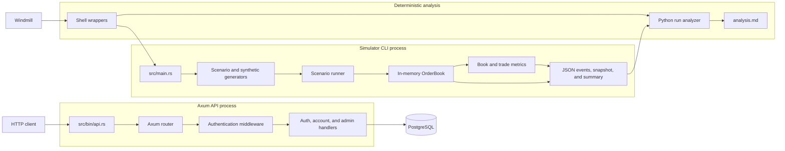

There is currently no connection from the Axum API to the `OrderBook`. Orders
submitted by network clients, a dedicated engine thread, bounded command
queues, and durable engine journaling are planned work.

## HTTP Routing And Middleware

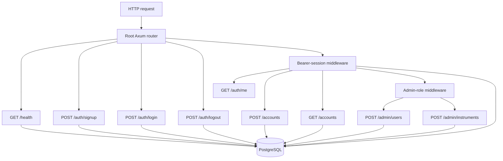

Middleware order matters for `/admin/*`: bearer authentication runs first and
inserts `AuthenticatedUser`; role authorization then reads that trusted value
and requires `role = admin`.

## Signup And Login

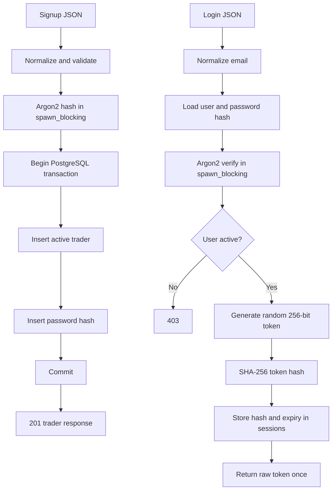

Public signup never accepts a role. It always creates a trader. The initial
administrator is created separately by `src/bin/bootstrap_admin.rs`.

## Protected Request And Logout

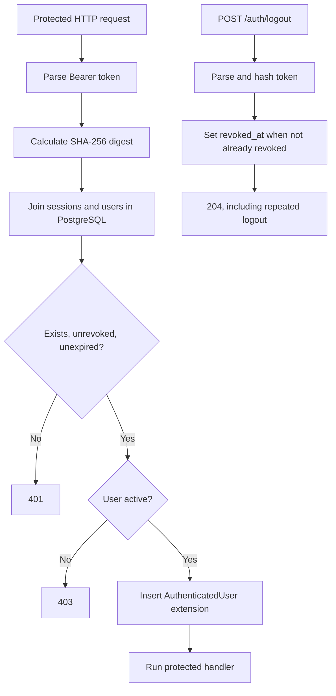

Only token hashes are stored. PostgreSQL remains the session authority; Redis
session caching is planned but not implemented.

## Account Creation And Listing

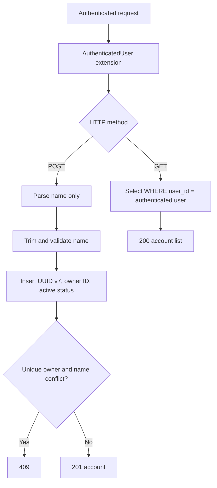

The client cannot provide `user_id`, `status`, or `id`. Ownership always comes
from authenticated middleware, and `UNIQUE (user_id, name)` permits different
users to reuse the same account name.

## Instrument Batch Creation

This flow is implemented and covered by PostgreSQL integration tests.

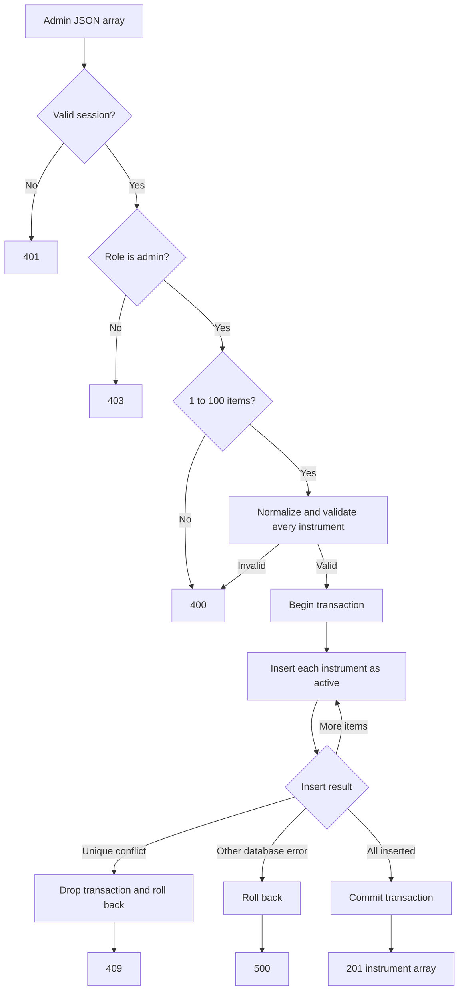

The transaction makes the batch atomic: either every instrument is created or
none of the new rows remain.

## Matching Engine

The current engine is synchronous and owned directly by the caller.

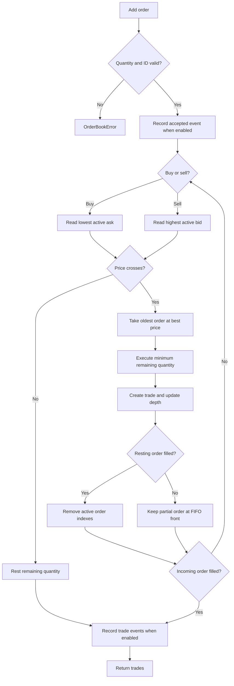

Current in-memory ownership:

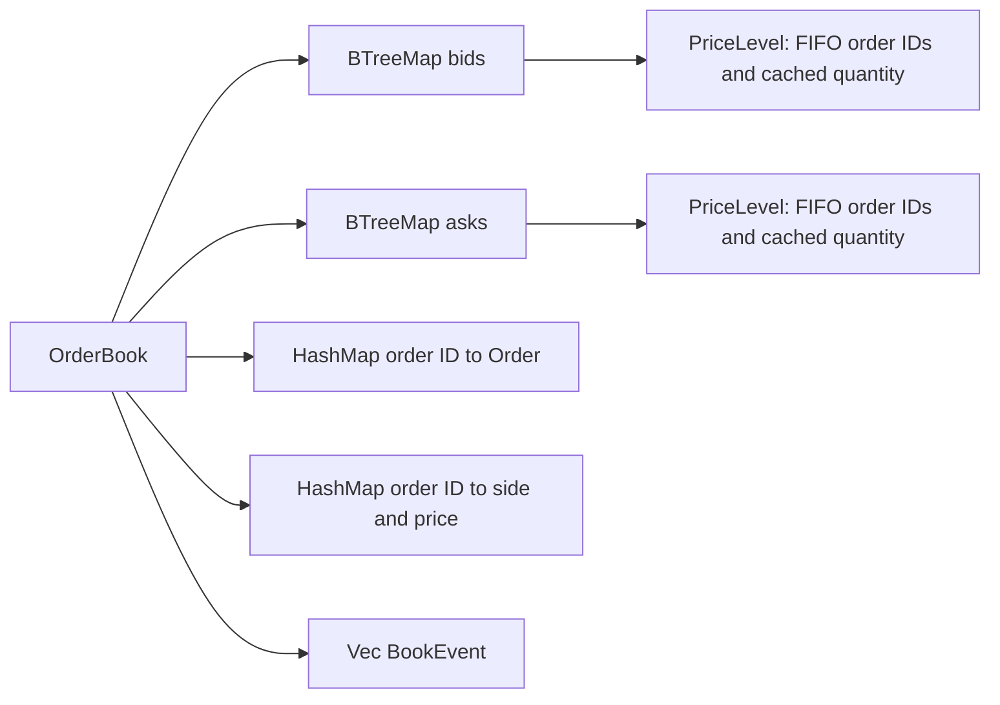

## Simulation, Artifacts, And Replay

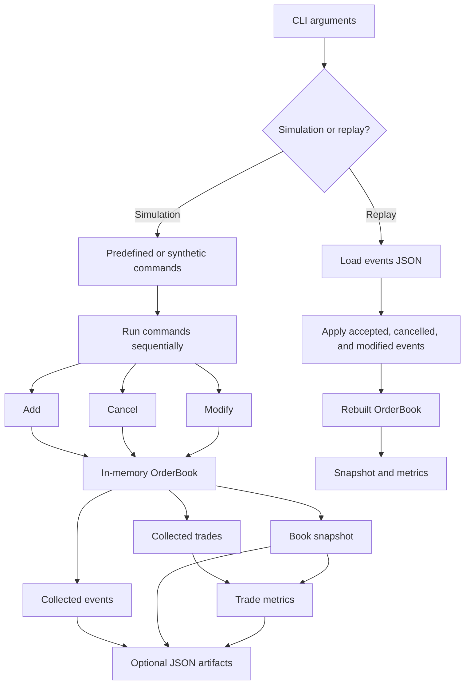

Trade events are not applied directly during replay. Replaying accepted and
modified orders deterministically produces those trades again.

## Current PostgreSQL Relationships

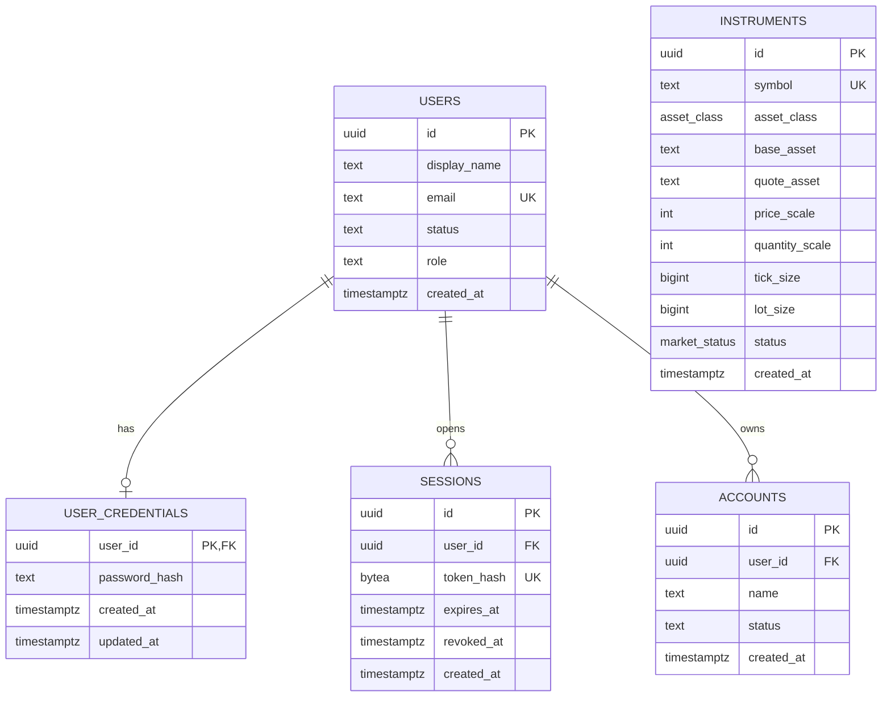

`instruments` is intentionally independent of users and accounts: an
instrument defines a market available to the whole trading system.

## Current Boundary Versus Planned HFT Runtime

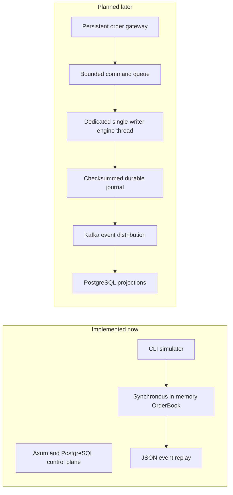

The next architectural bridge is not a database call from matching. It is a
bounded command path from a gateway to a dedicated engine owner, using local
validation snapshots derived from the control plane.
